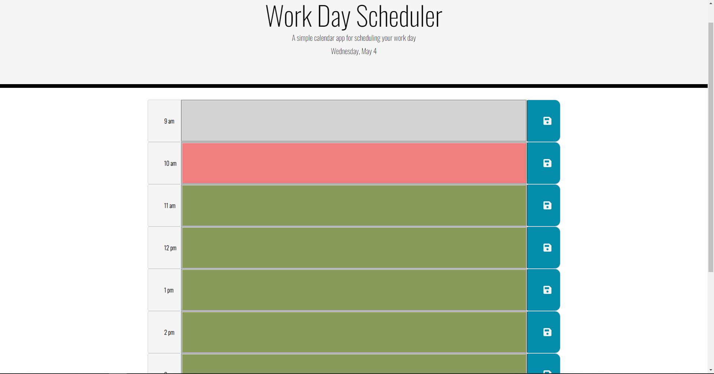

# Day-planner

[Link to my github](https://github.com/Drewpayton/Day-planner)

[link to website](https://drewpayton.github.io/Day-planner/)

# Description
This is a day planner for the work day. Containing a 9-5 work day schedule, you can add important day task to the hours of day

# Instructions

you can enter events in according to what time you have them. As the time in the day goes on the hours in the past will turn grey while the current hour turns red and the future hours will be green. You can click the save button to save all the events you have planned even if you close the browser it will still be there. Lastly there is a clear button so at the end of the day you can refresh all the events in your calender and start new the next day.

# Technology

I used vanilla javascript with html and and help of bootstrap library.

# License

None

